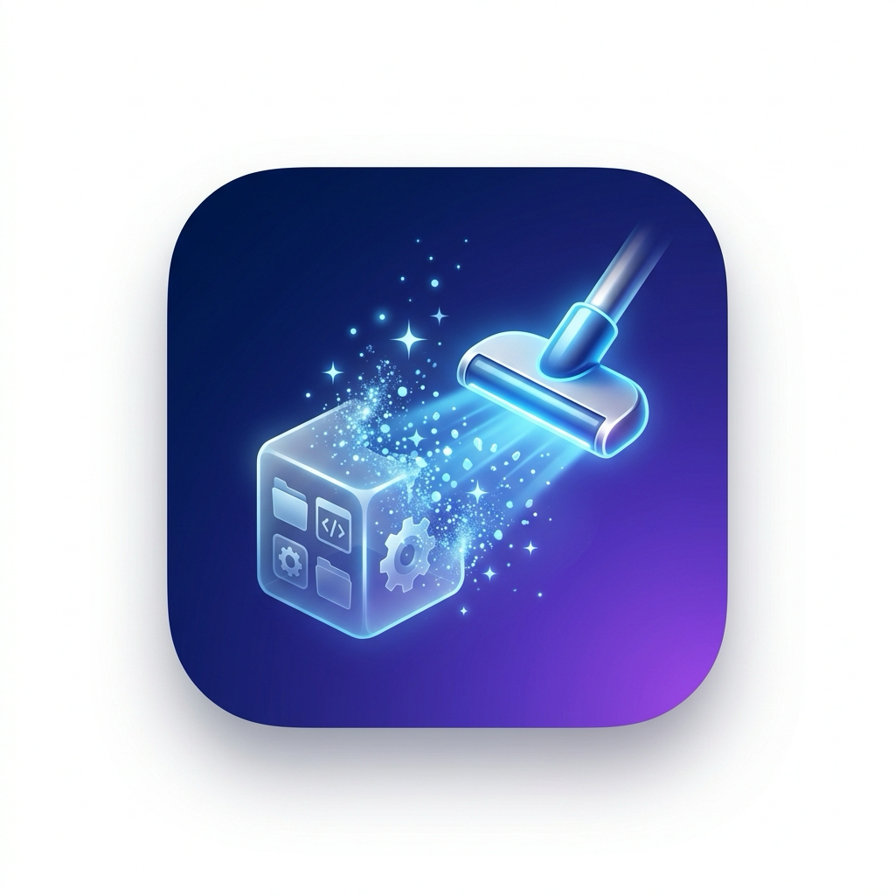

<p align="center">
  
</p>

# DeepUninstall

A modern, native macOS application uninstaller built with Swift 6 and SwiftUI. DeepUninstall finds and cleans up all residual files and caches left behind when uninstalling macOS applications.

---

## Features

- **Installed App Discovery**: Automatically scans `/Applications` and `~/Applications` with real-time search and sorting (by name or total size).
- **Drag & Drop**: Drag any `.app` onto the window or drop it onto the Dock icon to instantly inspect its leftovers.
- **Deep Leftover Detection**:
  - `Application Support` (including nested vendor directories like `Google/Chrome`)
  - `Caches` (User, System, and Darwin temporary caches)
  - `Preferences` (`.plist` files, ByHost preferences)
  - `Containers`, `Group Containers`, and `Application Scripts`
  - `Saved Application State`
  - `Web Data` (HTTPStorages, WebKit, Cookies)
  - `Logs & Crash Reports` (Diagnostic reports, `.ips` crash logs)
  - `Launch Agents & Daemons` (`LaunchAgents`, `/Library/LaunchDaemons`, `/Library/PrivilegedHelperTools`)
  - `Plug-ins & Extensions` (Internet plug-ins, QuickLook, Spotlight, Audio HAL)
- **Safety & Confidence Scoring**:
  - High confidence for exact Bundle Identifier matches.
  - Team ID matching for sandboxed group containers.
  - Sibling / Vendor matching marked with warnings and unchecked by default.
  - Strict system path and Apple protected directories whitelist to prevent accidental deletions.
- **Flexible Removal**:
  - Always asks whether to move files to **Trash** (recoverable) or **Delete Permanently**.
  - Warns and confirms before requesting administrator privileges for `/Library` system files.
  - Automatically checks if the application is running and gracefully quits it before removal.
- **Orphaned Files Scanner**: Detects reverse-DNS leftover files belonging to applications that have already been uninstalled in the past.
- **Full Disk Access Onboarding**: Built-in status check and guide to grant Full Disk Access for protected sandbox locations.

---

## Requirements

- macOS 14.0 or newer
- Apple Silicon or Intel Mac

---

## Building and Running

### Build `.app` Bundle
To build the release application bundle:
```bash
./build.sh
```
The resulting application is placed in `dist/DeepUninstall.app`.

### Build & Open Directly
```bash
./build.sh --open
```

### Run Unit Tests
```bash
swift test
```

---

## Architecture

- **`DeepUninstallCore`**: The decoupled business logic library:
  - `AppScanner`: Discovers installed apps and extracts bundle identifiers & Team IDs.
  - `SearchLocations`: Directory mapping across `~/Library`, `/Library`, and system caches.
  - `Matcher`: Confidence-based pattern matcher and safety rules.
  - `LeftoverFinder`: Parallel leftover discovery and nesting resolution.
  - `OrphanFinder`: Reverse-DNS scanner for uninstalled apps.
  - `Remover`: Trash / permanent deletion engine with batched privilege elevation and launchd unloads.
- **`DeepUninstall`**: SwiftUI front-end with responsive navigation, categorization, live size calculation, and sheet-based confirmation workflows.
- **`DeepUninstallCoreTests`**: Unit tests running against an isolated sandbox filesystem.
